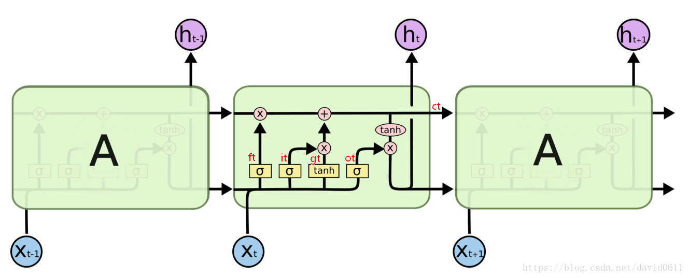

see also: https://blog.csdn.net/david0611/article/details/81090294

### RNN

对于最简单的 RNN，我们可以使用下面两种方式去调用，分别是 torch.nn.RNNCell() 和 torch.nn.RNN()，这两种方式的区别在于 RNNCell() 只能接受序列中单步的输入，且必须传入隐藏状态，而 RNN() 可以接受一个序列的输入，默认会传入全 0 的隐藏状态，也可以自己申明隐藏状态传入。

- RNN(input_dim ,hidden_dim ,num_layers ，…)
    – input_dim 表示输入$x_t$的特征维度
    – hidden_dim 表示输出的特征维度，如果没有特殊变化，相当于out
    – num_layers 表示网络的层数
    – nonlinearity 表示选用的非线性激活函数，默认是 ‘tanh’
    – bias 表示是否使用偏置，默认使用
    – batch_first 表示输入数据的形式，默认是 False，就是这样形式，(seq, batch, feature)，也就是将序列长度放在第一位，batch 放在第二位
    – dropout 表示是否在输出层应用 dropout
    – bidirectional 表示是否使用双向的 rnn，默认是 False

- 输入$x_t, h_0$
    – $x_t$ <seq,batch,input_dim>
    – $h_0$ <层数×方向,batch,h_dim>

- 输出$h_t, out$
    – output <seq,batch,h_dim×方向>
    – $h_t$ <层数×方向，batch,h_dim>


例子：

```python
# 构造RNN网络，x的维度5，隐层的维度10,网络的层数2
rnn_seq = nn.RNN(5, 10,2)
# 构造一个输入序列，长为 6，batch 是 3， 特征是 5
x = Variable(torch.randn(6, 3, 5))
out,ht = rnn_seq(x,h0) # h0可以指定或者不指定
# q1:这里out、ht的size是多少呢？ out:6*3*10, ht:2*3*5
# q2:out[-1]和ht[-1]是否相等？  相等！
```

### LSTM



